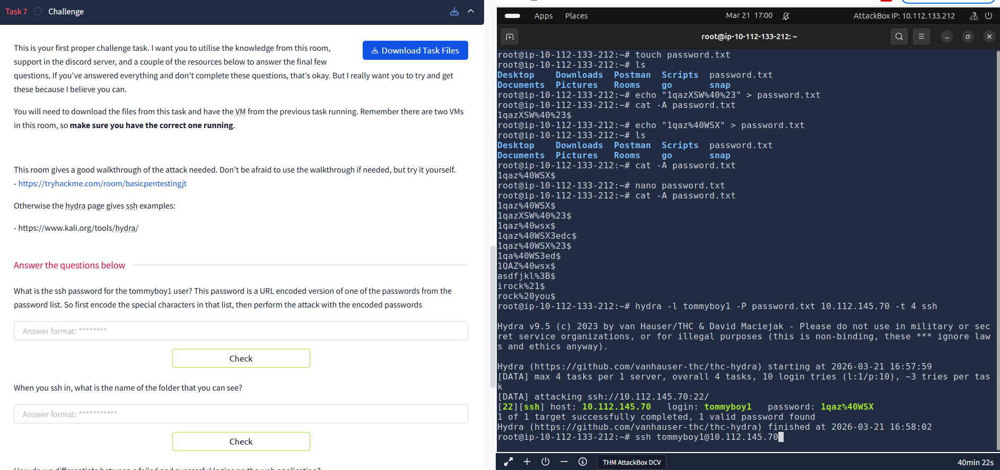

# MWR Virtual Internship – Task 7 (Hydra SSH Attack)

## Overview

In this task, I performed a brute-force attack against an SSH service using Hydra.
The goal was to find the password for the user `tommyboy1`.

## Tools Used
- Hydra
- Linux Terminal
- SSH

## Steps Taken
## 1. Prepare Password List
- Created a password file:
```bash
touch password.txt
```
- Added possible passwords and URL-encoded special characters as required by the task:
```bash
nano password.txt
```

## 2. Run Hydra Attack
```bash
hydra -l tommyboy1 -P password.txt 10.112.145.70 -t 4 ssh
```
- `-l` - specifies the username
- `-P` - password list
- `-t 4` - number of parallel tasks

Hydra performs real-time login attempts against the SSH service using the provided password list until valid credentials are found.

## 3. Successful Credentials Found
- Username: tommyboy1
- Password: 1qaz%40WSX

## 4. SSH login
Using the discovered credentials, I successfully logged into the target machine:
```bash
ssh tommyboy1@10.112.145.70
```



## What I Learned
- How brute-force attacks work in practice
- Using Hydra efficiently for SSH attacks
- Basic SSH access after credential compromise

## Security Insight
This attack highlights the importance of:
- Account lockout after multiple failed login attempts
- Rate limiting to slow down repeated login attempts
- Monitoring and alerting on suspicious login activity

## Disclaimer
This was performed in a legal lab environment (TryHackMe) for educational purposes only.
