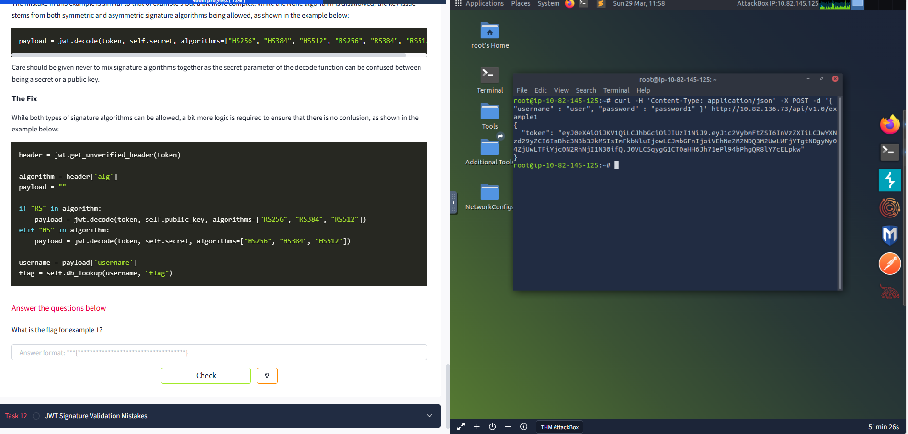
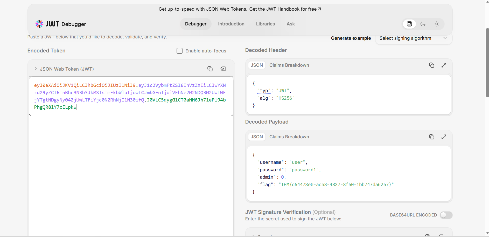

# JWT Sensitive Information Disclosure (TryHackMe)

## Overview
In this lab, I analysed how a web application uses JSON Web Tokens (JWTs) and identified a critical security issue involving the exposure of sensitive information.

Although JWTs are commonly used for authentication, improper handling can lead to serious security vulnerabilities.

## Key Concept
A JWT consists of three parts:
```bash
HEADER.PAYLOAD.SIGNATURE
```
- `Header` - Specifies the signing algorithm (e.g HS256)
- `Payload` - Contains user data (claims)
- `Signature` - Ensures the token has not been tampered with

**Important:**
JWT payloads are Base64 Encoded, NOT Encrypted.

## Initial Request
I sent a POST request using `curl`:
```bash
curl -H 'Content-Type: application/json' \
-X POST \
-d '{ "username" : "user", "password" : "password1" }' \
http://10.82.136.73/api/v1.0/example1
```

## Server Response
The server returned a JWT token:
```bash
eyJ0eXAiOiJKV1QiLCJhbGciOiJIUzI1NiJ9...
```


## Decoding the JWT
I used jwt.io to decode the token.
### Decoded Payload
```JSON
{
"username": "user",
"password": "password1",
"admin": 0,
"flag": "THM{c64473e0-aca8-4827-8f50-1bb747da6257}"
}
```


## Vulnerability: Sensitive Information Disclosure
The application exposes sensitive data directly inside the JWT payload:

- Password
- Admin privilege level
- Flag (Sensitive value)

### Why this is a problem
JWTs are only Base64 encoded (not encrypted), meaning:
```bash
Attacker -> Decodes Token -> Reads Sensitive Data
```

## Mitigation
To prevent this vulnerability:

- Do NOT store sensitive data in JWT payloads
- Always treat JWT payloads as publicly readable
- Use proper server-side validation and secure design practices

## Personal Reflection
This lab helped reinforce the importance of secure data handling in authentication systems. It also highlighted how misunderstandings about JWTs can lead to critical vulnerabilities.
